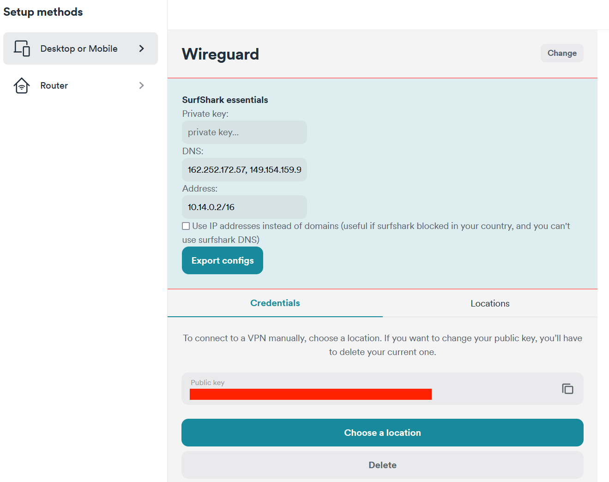

# Surfshark Essentials

This extension improve expirience of surfshark website. Now you can export all Wireguard configs in one click. Also you can tweak generated configurations by changing **DNS**, **Address** and optionaly change hostnames to **server ip addresses** which fetched automaticaly from cloudflare DNS.

All configs exported in zip format.
Import tested on latest **windows** and **ios**

## Install

	$ npm install

## Development

    npm run dev chrome
    npm run dev firefox
    npm run dev opera
    npm run dev edge

## Build

    npm run build chrome
    npm run build firefox
    npm run build opera
    npm run build edge

## Environment

The build tool also defines a variable named `process.env.NODE_ENV` in your scripts. 

## This extension uses webextension-toolbox, see

* [webextension-toolbox](https://github.com/HaNdTriX/webextension-toolbox)
